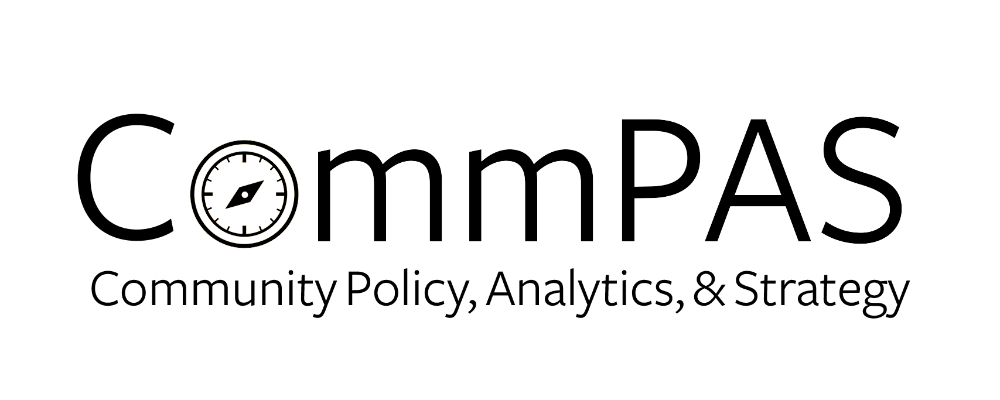

## The Project

The charitable nonprofit sector dashboard uses data from the Urban Institute's [National Center for Charitable Statistics Data Archive](https://nccs-data.urban.org/index.php), capturing information about nonprofit organizations based on tax filings. We've pulled the data for Charlottesville and surrounding localities to provide a view of the charitable nonprofit landscape -- the number of organizations, the area in which they work, their income and assets.

The nonprofit sector in the Greater Charlottesville region is large and dynamic, making it difficult for many to keep up with and fully understand. It is also deeply uneven with respect to levels of funding and resources across communities and areas of activity. Our hope is that this interactive resource offers utility to citizens, government actors, foundations, and people working in the nonprofit sector to better understand the size, scope, and emphasis of this sector.

## The Charitable Organizations
Organizations listed as charitable nonprofits on this web page were originally classified by the IRS as having substantial revenues generated by a government unit or by the public. Our goal is to identify organizations that broadly provide public services and programs. Most charitable nonprofits are accurately categorized by this revenue scheme. Organizations listed as charitable foundations were originally classified by the IRS as private non-operating foundations. Our intent is to represent organizations that provide grants and support to other charitable service or program-oriented nonprofits. 

We exclude other categories of tax-exempt organizations that focus more on private services to dues-paying members (e.g., fraternal organizations), provide services to narrow target group (e.g., parent-teacher organizations), or primarily support another primary organization (e.g. university-related foundations). Organizations can be miscoded in the original data. We have manually reviewed the data and recategorized a small number of organizations. If you believe an organization has been incorrectly included or excluded, please contact us at [commpaslab@virginia.edu](mailto:commpaslab@virginia.edu). 

## The Dashboard

Click the tabs above to see a map of the selected nonprofits (**Maps**), a table of information for selected nonprofits (**Table**), visualizations of the organizations (**Organizations**), of income (**Income**), and of assets (**Assets**).  The **Initial Data** tab lists the original data set accessed through the Urban Institute's website, and the **About the Data** tab provides details about the data collection and variable definitions.
                                
Within the Map, Table, Organizations, Income, and Assets tabs, the checkboxes on the left will filter the summaries to show organizations within the selected localities and with the selected area/group codes. The data in these summaries contain only organization coded as charitable nonprofits or private grant-making foundations. We will be inspecting this data for accuracy in the coming months, as recommended by NCCS, and updating accordingly. The Initial Data tab provides the data for the region as it was downloaded from NCCS, which includes many additional types of nonprofit tax-exempt entities.

## The Lab
                                   
The [CommPAS Lab](http://commpas-lab.mystrikingly.com/) represents a collaboration between the Batten School of Leadership and Public Policy and the UVA Library's StatLab.

The CommPAS Lab sponsors the community-oriented work and collaboration between the Batten School of Leadership and Public Policy and the UVA Library's StatLab. Through courses and research projects, the CommPAS Lab works in partnership with local agencies, nonprofits, and citizen groups to produce actionable research and resources. The CommPAS Lab brings students into community-engaged research where they learn about local challenges while developing and
applying their policy and data science skills in the service of our community partners.

We welcome feedback and suggestions at [commpaslab@virginia.edu](mailto:commpaslab@virginia.edu).

